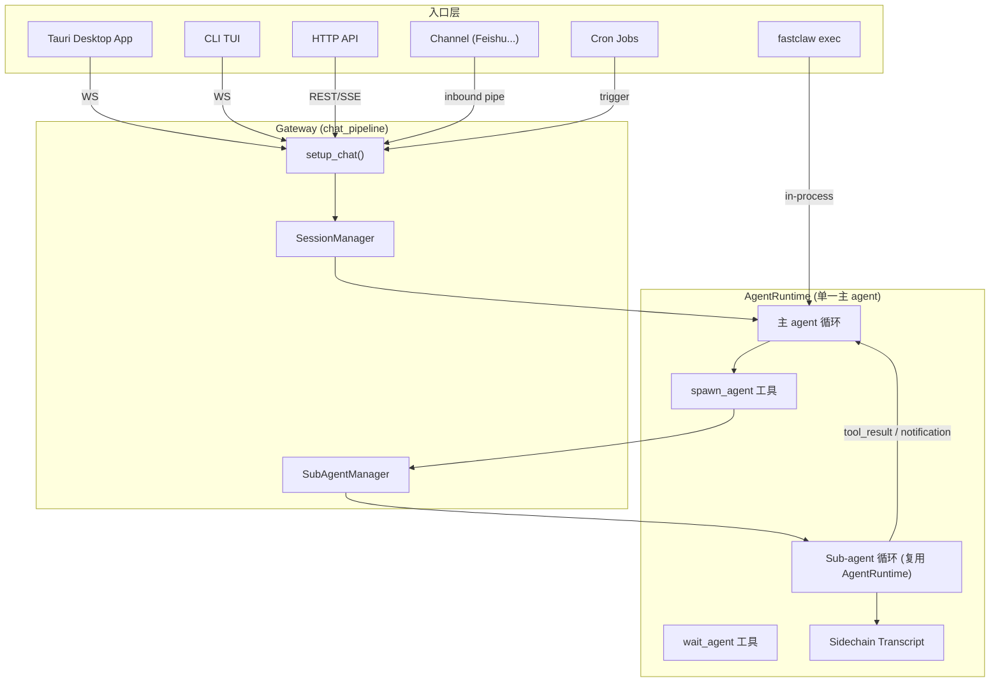
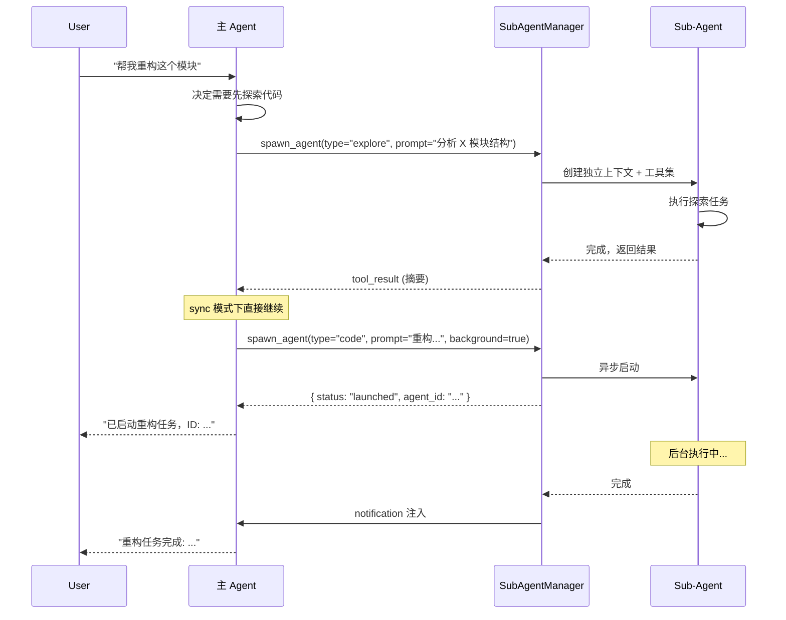

# 单对话框 + Sub-Agent 编排重构 Spec

> 状态：Draft v1  
> 日期：2026-05-28  
> 参考：claude-code (Agent tool + sidechain)、codex (Thread tree + AgentControl)

---

## 1. 现状问题

当前 FastClaw 采用**多 agent IM 模式**：

- 前端 `AgentList` 呈现多个 agent "联系人"，用户在不同 agent 之间切换聊天
- 每个 agent 有独立人格（`AgentConfig`：model、systemPrompt、tools、behavior）
- Session 绑定到特定 agent（`sessions.agent_id`）
- Channel（Feishu）通过 route bindings 将消息分发到不同 agent
- TUI 通过 `/agent` 命令切换当前 agent
- HTTP API 接受 `agentId` 参数选择目标 agent

**核心问题**：多 agent 人格切换对实际工作效率无帮助。用户面对多个"聊天对象"，但本质都是同一个 LLM，不如由单一 agent 自主编排 sub-agent 来处理不同子任务。

---

## 2. 目标架构

用户在**所有入口**（Tauri App、TUI、HTTP API、Channel、exec）面对的都是**单一主 agent**。主 agent 通过工具调用编排 sub-agent 完成复杂任务。



---

## 3. 各入口变化详述

### 3.1 Tauri Desktop App

| 维度 | 现在 | 目标 |
|------|------|------|
| 左侧栏 | `AgentList`（agent 联系人列表） | `SessionList`（纯 session 列表） |
| Agent 选择 | 点击不同 agent 切换聊天对象 | 无需选择，始终与主 agent 对话 |
| Chat 请求 | `{ agentId, sessionId, messages }` | `{ sessionId, messages }`（agentId 固定为 main） |
| Sub-agent 展示 | `SubAgentCard` 内联在父对话 | 保持不变，可扩展进度面板 |
| Agent 配置 | `AgentDetail` 编辑人格/工具 | 移至 Settings → Sub-agent 定义管理 |
| 状态管理 | `useAgentStore`: agents, activeAgentId, agentChats | 简化为 sessions-only store |

**关键文件影响：**
- 删除：`components/agent-list/`、`components/agent-detail/`
- 大改：`lib/stores/`（移除 agent 维度切片）、`transport.ts`（移除 agentId 参数）
- 保留：`MessageStream`、`SubAgentCard`、`ChatTabsBar`（改为 session 维度）

### 3.2 TUI / CLI

| 维度 | 现在 | 目标 |
|------|------|------|
| Agent 选择 | `/agent <id>` 切换 | 删除 `/agent` 命令 |
| WS 请求 | `{ method: "chat", params: { agentId, ... } }` | `{ method: "chat", params: { ... } }`（固定 main） |
| Agent 列表展示 | 连接时接收 `agents` 列表，显示在状态栏 | 移除 agent 列表展示 |
| Sub-agent 展示 | Sub-agent 事件渲染为 spinner/card | 保持，增强显示嵌套进度 |
| `fastclaw agents` 子命令 | 列出/创建/删除 agent | 改为列出/管理 sub-agent 定义 |

**关键文件影响：**
- `crates/fastclaw-cli/src/tui/ws.rs` — 移除 `agentId` 发送
- `crates/fastclaw-cli/src/tui/commands.rs` — 删除 `/agent` slash 命令
- `crates/fastclaw-cli/src/main.rs` — `agents` 子命令语义变更为 sub-agent 管理

### 3.3 HTTP API

| 维度 | 现在 | 目标 |
|------|------|------|
| `POST /api/v1/chat` | body 含 `agentId` | `agentId` 参数 deprecated（忽略或仅接受 "main"） |
| `GET /api/v1/agents` | 返回所有 agent 配置 | 返回可用 sub-agent 定义列表 |
| `POST/PUT /api/v1/agents` | 创建/更新 agent 人格 | 改为创建/更新 sub-agent 定义 |
| `DELETE /api/v1/agents/:id` | 删除 agent | 改为删除 sub-agent 定义 |
| `_meta.resolvedAgent` | 返回解析到的 agent | 始终返回 "main" |
| Session 创建 | `resolve_session_context(agent_id)` | 固定 agent_id = "main" |

**关键文件影响：**
- `crates/fastclaw-gateway/src/routes/chat.rs` — `setup_chat()` 不再需要 resolve agent
- `crates/fastclaw-gateway/src/routes/agents.rs` — 语义变更为 sub-agent 定义 CRUD
- `crates/fastclaw-gateway/src/chat_pipeline.rs` — 简化 agent 解析步骤

### 3.4 Channel（Feishu 等）

这是影响最复杂的入口，因为当前支持**不同聊天群/DM 绑定不同 agent**。

| 维度 | 现在 | 目标 |
|------|------|------|
| Agent 路由 | `resolve_route()` 按 bindings 分配不同 agent | 始终使用主 agent |
| 不同群不同人格 | 通过 `config.bindings` 实现 | 删除；如需差异化，通过 channel context injection 实现 |
| Session key | `agent:main:feishu:ou_xxx` 含 agent 前缀 | 简化为 `feishu:ou_xxx`（移除 agent 维度） |
| 频道特定工具 | `FeishuPlugin.llm_tools()` 注入当前 agent | 直接注入主 agent 的工具集 |
| 频道上下文注入 | `inject_channel_context()` 告知 agent 在 IM 中 | 保留不变 |
| `/new` `/help` 等命令 | `handle_slash_command()` | 保留，删除 `/agent` 相关 |

**差异化需求的替代方案**：如果用户确实需要不同群有不同行为，可通过以下机制实现（不需要多 agent）：
1. **Per-channel prompt injection** — `inject_channel_context()` 已有的机制，可扩展为 per-group 配置
2. **Sub-agent 定义绑定** — 特定群默认使用特定 sub-agent 组合
3. **Channel skill packs** — 不同频道启用不同工具子集

**关键文件影响：**
- `crates/fastclaw-core/src/routing.rs` — 删除 `resolve_route()` 的多 agent 匹配，保留 channel 身份识别
- `extensions/feishu/src/plugin.rs` — 移除 agent binding 相关逻辑
- `crates/fastclaw-gateway/src/routes/channel.rs` — `handle_channel_message()` 固定使用主 agent
- `config/agents/*.json` 中的 `channels` 字段 — 移至主配置或 channel 专用配置

### 3.5 `fastclaw exec`

| 维度 | 现在 | 目标 |
|------|------|------|
| Agent 解析 | `Router.resolve()` → default agent | 直接加载 main config |
| 变化程度 | 最小 | 仅简化路由逻辑 |

**关键文件影响：**
- `crates/fastclaw-cli/src/exec/mod.rs` — 移除 Router 依赖，直接构建 main agent 配置

### 3.6 Cron Jobs

| 维度 | 现在 | 目标 |
|------|------|------|
| 触发目标 | `JobTrigger.agent_id` 指定 | 固定为主 agent |
| 不同 cron 不同人格 | 每个 cron job 可绑定不同 agent | 通过 prompt 注入区分 cron 任务上下文 |

**关键文件影响：**
- `crates/fastclaw-cron/` — `agent_id` 字段 deprecated，固定 "main"

### 3.7 MCP Server

| 维度 | 现在 | 目标 |
|------|------|------|
| 语义 | 暴露 FastClaw 工具给外部 agent | 不变 |
| Agent 依赖 | 工具集来自 resolved agent | 工具集来自主 agent 配置 |
| 变化程度 | 最小 | 移除 agent 选择逻辑 |

---

## 4. 核心设计详述

### 4.1 Agent 模型重定义

**旧概念映射：**

| 旧概念 | 新概念 | 说明 |
|--------|--------|------|
| `AgentConfig`（多个人格） | `MainAgentConfig`（唯一主 agent） | 只有一份，`config/main.json` |
| `AgentConfig`（子 agent 能力） | `SubAgentDef` | 定义 sub-agent 类型的 model/tools/prompt |
| `AgentRouter` | 删除 | 不再需要路由 |
| `config/agents/*.json` | `config/sub-agents/*.json` 或 `.fastclaw/agents/*.md` | 仅定义 sub-agent |
| `sessions.agent_id` | 固定 "main" 或删除字段 | Session 不再关联 agent |

**MainAgentConfig** 结构（config/main.json）：

```json
{
  "model": { "provider": "...", "model": "...", ... },
  "systemPrompt": null,
  "tools": { ... },
  "behavior": {
    "subagent": {
      "enabled": true,
      "max_depth": 3,
      "max_parallel": 5,
      "builtin_agents": ["explore", "code", "shell", "research"],
      "custom_agents_dir": ".fastclaw/agents"
    },
    ...
  },
  "mcpServers": [...],
  "channels": { "feishu": { ... } }
}
```

**SubAgentDef** 结构：

```json
{
  "id": "explore",
  "name": "Explorer",
  "description": "Read-only exploration and code analysis",
  "model": null,
  "tools": { "allowed": ["read_file", "list_dir", "search", "grep"], "denied": ["write_file", "shell_exec"] },
  "systemPrompt": "You are a code exploration assistant...",
  "background": false,
  "concurrency_safe": true
}
```

用户自定义 sub-agent（Markdown frontmatter，参考 Claude Code `loadAgentsDir`）：

```markdown
---
id: reviewer
name: Code Reviewer
tools:
  allowed: [read_file, grep, search]
  denied: [write_file, shell_exec]
model: null
---

You are a code review specialist. Analyze the provided code for...
```

### 4.2 Sub-Agent 编排机制

**工具接口设计：**

```
spawn_agent(
  type: string,           // "explore" | "code" | "shell" | "research" | custom ID
  prompt: string,         // 任务描述
  background?: bool,      // 默认 false (sync)
  context?: string[],     // 额外上下文文件路径
  fork_depth?: number,    // fork 父对话最近 N 条消息
)

wait_agent(
  agent_id: string,       // 来自 spawn_agent 返回的 ID
  timeout_ms?: number,
)

send_message(
  agent_id: string,
  message: string,
)

list_agents()             // 返回所有可用 sub-agent 定义
```

**执行流程：**



**上下文隔离实现：**

| 层 | 隔离方式 |
|------|----------|
| 消息历史 | 独立 sidechain transcript 文件（`sessions/{id}/subagents/{agent_id}.jsonl`） |
| 工具集 | 按 `SubAgentDef.tools` 过滤（explore 只有只读工具） |
| 沙箱 | 继承父级 workspace 权限（不额外隔离文件系统） |
| 模型 | 可覆盖（sub-agent 可用更小/更快的模型） |
| 生命周期 | 父 session 关闭 → 所有子 agent 终止 |

**结果回流：**

| 模式 | 回流方式 | 父对话影响 |
|------|----------|-----------|
| Sync | `tool_result` 在当前 turn | 主 agent 继续同一 turn |
| Async | notification 注入为 user message | 触发新 turn |

### 4.3 Session 模型变化

```
-- 旧模型
sessions(id, agent_id, title, ...)  -- agent_id = "main" | "research" | ...

-- 新模型
sessions(id, title, ...)            -- 无 agent_id，或固定 "main"
subagent_runs(id, parent_session_id, agent_type, status, transcript_path, ...)
```

**Session key 变化（Channel）：**

| 入口 | 旧 key | 新 key |
|------|--------|--------|
| Feishu DM | `agent:main:feishu:account:peer` | `feishu:account:peer` |
| Feishu Group | `agent:main:feishu:account:group:chat_id` | `feishu:account:group:chat_id` |

---

## 5. 各入口流程对比（重构前 vs 后）

### 5.1 Chat Pipeline 变化

**重构前** (`chat_pipeline.rs` → `setup_chat()`):

```
1. resolve agent (Router.resolve → AgentConfig)
2. resolve session (agent_id + session_id → Session)
3. prompt guard
4. context ingest (memory/RAG)
5. model routing
6. budget reservation
7. execute turn
```

**重构后**:

```
1. load main config (单一配置，无需路由)
2. resolve session (session_id → Session)
3. prompt guard
4. context ingest
5. model routing
6. budget reservation
7. execute turn (主 agent，sub-agent 由工具触发)
```

### 5.2 WS 协议变化

**移除的 methods：**
- `agents` — 获取 agent 列表
- `agents.create` / `agents.update` / `agents.delete`
- `agents.reload`

**新增/变更的 methods：**
- `sub_agents.list` — 列出 sub-agent 定义
- `sub_agents.runs` — 查看当前 session 的 sub-agent 运行
- Chat params 中 `agentId` 字段 deprecated

**事件流不变：**
- `turn_start`, `content_delta`, `tool_executing`, `tool_result`, `turn_end` — 主 agent 产生
- `sub_agent_start`, `sub_agent_delta`, `sub_agent_complete` — sub-agent 产生（已有）

### 5.3 Channel Pipeline 变化

**重构前**:

```
inbound message → resolve_route(bindings) → agent_id
→ build_session_key(agent_id, channel, peer)
→ setup_chat(agent_id, session_id)
→ handle_channel_streaming()
```

**重构后**:

```
inbound message → identify channel/peer (身份识别，非 agent 路由)
→ build_session_key(channel, peer)
→ setup_chat(session_id)  // 固定 main agent
→ inject_channel_context(channel_type, group_config)  // 差异化靠 context
→ handle_channel_streaming()
```

---

## 6. 关键文件变更总览

### 6.1 删除

| 文件/目录 | 原因 |
|-----------|------|
| `crates/fastclaw-gateway/src/routes/agents.rs` | 多 agent CRUD → 改为 sub-agent def CRUD |
| `crates/fastclaw-gateway/src/ws/agents.rs` | WS agent 管理 |
| `crates/fastclaw-core/src/routing.rs` 中的 `AgentRouter` | 不再需要多 agent 路由 |
| `config/agents/` 目录（除 main.json） | 人格配置不再有意义 |
| `crates/fastclaw-app/src/components/agent-list/` | IM 联系人 UI |
| `crates/fastclaw-app/src/components/agent-detail/` | Agent 人格编辑 UI |
| `prompts/agents/*.md`（多人格 prompt） | 不再需要多人格 |

### 6.2 大改

| 文件 | 变化内容 |
|------|----------|
| `crates/fastclaw-core/src/agent_config.rs` | `AgentConfig` 拆分为 `MainAgentConfig` + `SubAgentDef` |
| `crates/fastclaw-core/src/routing.rs` | 保留 channel 身份识别，删除 agent 路由 |
| `crates/fastclaw-gateway/src/chat_pipeline.rs` | 简化 `setup_chat()`，移除 agent 解析 |
| `crates/fastclaw-gateway/src/state/builder.rs` | 不再构建 Router，直接加载 main config |
| `crates/fastclaw-gateway/src/routes/channel.rs` | `handle_channel_message()` 固定 main agent |
| `crates/fastclaw-agent/src/subagent_manager.rs` | 升级为核心编排（sync/async、sidechain、notification） |
| `crates/fastclaw-agent/src/subagent.rs` | 工具重设计（spawn/wait/send/list） |
| `crates/fastclaw-agent/src/agent_discovery.rs` | `list_agents` 语义改为列出 sub-agent 定义 |
| `crates/fastclaw-session/src/models.rs` | `sessions.agent_id` 移除或固定 |
| `crates/fastclaw-session-actor/src/` | 支持 async notification re-entry |
| `crates/fastclaw-cli/src/tui/` | 移除 agent 切换逻辑 |
| `crates/fastclaw-cli/src/main.rs` | `agents` 子命令改为 sub-agent 管理 |
| `extensions/feishu/src/plugin.rs` | 移除 agent binding 路由 |
| `crates/fastclaw-cron/` | `agent_id` 字段 deprecated |
| `crates/fastclaw-app/src/lib/stores/` | 移除 agent 切片，session-first |
| `crates/fastclaw-app/src/components/message-stream/` | 移除 agent 维度逻辑 |

### 6.3 新增

| 文件/目录 | 内容 |
|-----------|------|
| `config/main.json` | 唯一主 agent 配置 |
| `config/sub-agents/` | 内置 sub-agent 定义（explore.json, code.json, shell.json, research.json） |
| `.fastclaw/agents/*.md` | 用户自定义 sub-agent（Markdown frontmatter） |
| `crates/fastclaw-agent/src/subagent/sidechain.rs` | Sidechain transcript 读写 |
| `crates/fastclaw-agent/src/subagent/builtin_agents.rs` | 内置 sub-agent 注册 |
| `crates/fastclaw-app/src/components/settings/sub-agents/` | Sub-agent 定义管理 UI |
| `crates/fastclaw-gateway/src/routes/sub_agents.rs` | Sub-agent 定义 CRUD API |

---

## 7. 数据迁移

| 对象 | 迁移策略 |
|------|----------|
| `sessions` 表 | `UPDATE sessions SET agent_id = 'main'`（或 schema migration 删除字段） |
| `config/agents/*.json` | `main.json` → `config/main.json`；其余如有 sub-agent 价值则转为 `config/sub-agents/*.json` |
| `subagent_runs` 表 | 保留不变（已有 parent_session_id） |
| Channel bindings | 迁移到 `config/main.json` 的 channels 节点（不再按 agent 分） |
| 前端 localStorage | 清除 `agents`、`agentChats` 等旧状态；仅保留 sessions |
| TUI 配置 | 移除 `default_agent` 等字段 |
| Cron jobs | `agent_id` 字段忽略（向后兼容，不报错） |

---

## 8. 向后兼容与 Deprecation

| API / 参数 | 策略 |
|-------------|------|
| `ChatRequest.agentId` | 接受但忽略（warn log），始终使用 main |
| `GET /api/v1/agents` | 返回 sub-agent 定义列表（语义变更，结构兼容） |
| WS `agents` method | 返回空列表 + deprecation notice |
| `fastclaw agents list` CLI | 改为列出 sub-agent 定义 |
| Channel bindings config | 仍可解析，但不再影响 agent 选择（warn + 文档引导迁移） |

---

## 9. 渐进式实施路径

### Phase 1: Backend 单 agent 化（低风险）

1. 新增 `MainAgentConfig` 类型 + 加载逻辑
2. `chat_pipeline.rs` 中 `setup_chat()` 固定使用 main config（保留 Router 兼容层）
3. Channel 路由 `resolve_route()` 改为始终返回 "main"
4. `sessions.agent_id` 字段设为默认 "main"，不再在业务逻辑中使用
5. TUI 移除 `/agent` 命令
6. 验证所有入口正常工作

### Phase 2: Sub-Agent 工具重设计

1. 定义 `SubAgentDef` schema + 加载（builtin + custom dir）
2. 重写 `spawn_agent` / `wait_agent` / `send_message` / `list_agents` 工具
3. 实现 sidechain transcript（独立文件存储）
4. 实现 sync（阻塞等待 tool_result）和 async（notification re-entry）双模式
5. 上下文隔离：工具过滤、独立消息历史、模型可覆盖
6. 内置 sub-agent：Explore（只读）、Code（读写）、Shell（命令执行）、Research（搜索+分析）

### Phase 3: 前端重构

1. 删除 `AgentList` + `AgentDetail` 组件
2. Store 重构：移除 agent 切片，改为 session-first
3. `ChatTabsBar` 改为纯 session 多标签
4. 新增 Settings → Sub-agent 管理页
5. `SubAgentCard` 增强：显示 sidechain 进度、可展开详情

### Phase 4: 清理 + 高级特性

1. 删除旧 `AgentRouter`、`routing.rs` 中的 multi-agent 逻辑
2. 删除 `routes/agents.rs`（替换为 `routes/sub_agents.rs`）
3. Schema migration：`sessions` 表移除 `agent_id` 列
4. 用户自定义 sub-agent（Markdown frontmatter + hot reload）
5. 并行 sub-agent（`concurrency_safe` 标记 + Semaphore 控制）
6. Fork 模式（继承父对话上下文前缀）
7. Sub-agent notification + 任务进度追踪 UI

---

## 10. 风险与决策点

| 决策点 | 选项 | 建议 |
|--------|------|------|
| Channel 差异化需求 | A) 完全删除 per-channel agent 路由 <br> B) 保留 channel context injection 实现差异化 | B — 通过 `inject_channel_context()` + per-group prompt config 替代多 agent |
| `AgentConfig` 重命名时机 | A) Phase 1 就重命名 <br> B) Phase 4 清理时统一重命名 | B — 减少 Phase 1 变更面 |
| Session 表 schema | A) 立即删除 `agent_id` 列 <br> B) 保留列但固定值 | B (Phase 1-3)，A (Phase 4) |
| Sub-agent 默认并发数 | 参考 claude-code (无显式限制) vs codex (max 64) | 默认 max_parallel = 5，可配置 |
| Sidechain 持久化 | A) SQLite (与 sessions 同库) <br> B) JSONL 文件 (参考 claude-code) | A — 与现有 `subagent_runs` 表统一，查询方便 |
